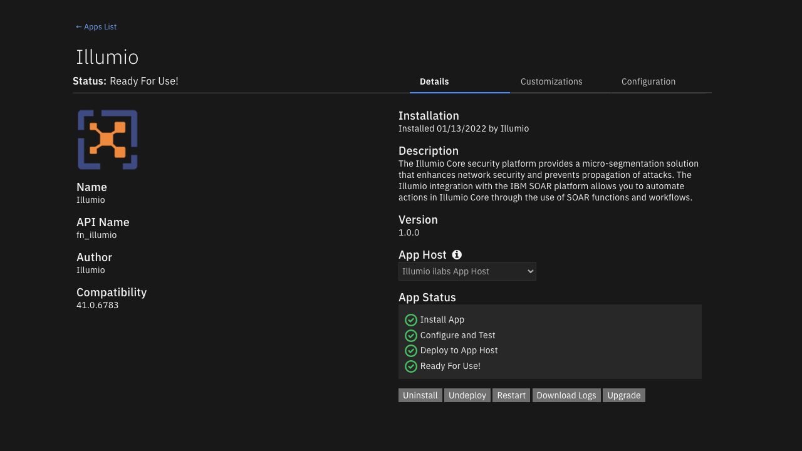
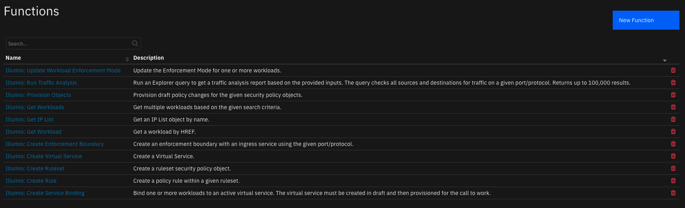
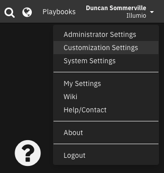
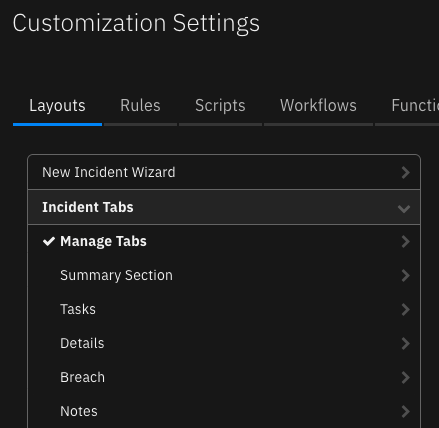
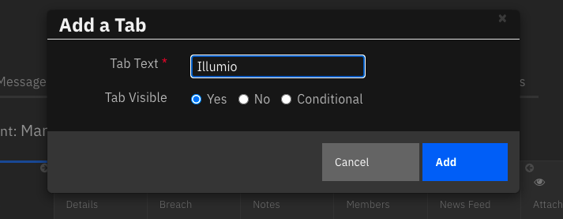
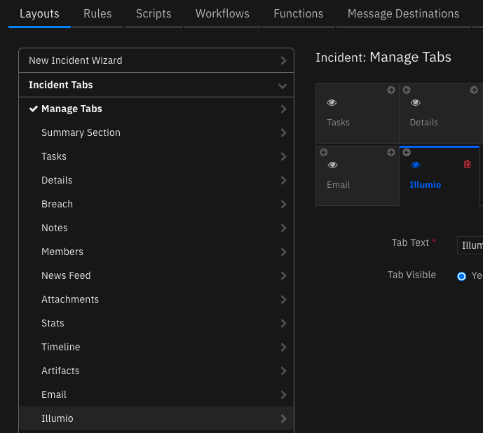
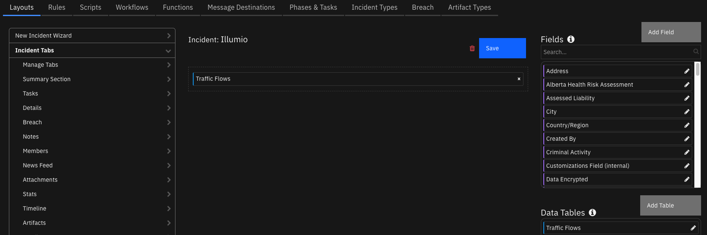

<!--
  This README.md is generated by running:
  "resilient-sdk docgen -p fn_illumio"

  It is best edited using a Text Editor with a Markdown Previewer. VS Code
  is a good example. Checkout https://guides.github.com/features/mastering-markdown/
  for tips on writing with Markdown

  If you make manual edits and run docgen again, a .bak file will be created

  Store any screenshots in the "doc/screenshots" directory and reference them like:
  

  NOTE: If your app is available in the container-format only, there is no need to mention the integration server in this readme.
-->

# Illumio

## Table of Contents
- [Release Notes](#release-notes)
- [Overview](#overview)
  - [Key Features](#key-features)
- [Requirements](#requirements)
  - [Resilient platform](#resilient-platform)
  - [Cloud Pak for Security](#cloud-pak-for-security)
  - [Proxy Server](#proxy-server)
  - [Python Environment](#python-environment)
  - [Performance Considerations](#performance-considerations)
- [Installation](#installation)
  - [Install](#install)
  - [App Configuration](#app-configuration)
  - [Custom Layouts](#custom-layouts)
- [Troubleshooting & Support](#troubleshooting--support)
---

## Release Notes
<!--
  Specify all changes in this release. Do not remove the release
  notes of a previous release
-->
| Version | Date | Notes |
| ------- | ---- | ----- |
| 1.0.0 | 02/2022 | Initial Release. Block port workflow and related actions |

---

## Overview
<!--
  Provide a high-level description of the function itself and its remote software or application.
  The text below is parsed from the "description" and "long_description" attributes in the setup.py file
-->
**Illumio Core Integration for IBM SOAR**

 

The [Illumio Core security platform](https://www.illumio.com/products/core) provides a micro-segmentation solution that enhances network security and prevents propagation of attacks. The Illumio integration with the IBM SOAR platform allows you to automate actions in the Illumio Core Policy Compute Engine using SOAR functions and workflows.  

You can find additional documentation for your version of Illumio Core through the [Illumio Support Portal](https://docs.illumio.com/core/21.2/Content/Home.htm).  

> The actions in this integration perform changes to the Illumio Policy Compute Engine that may impact the flow of traffic between workloads in your network. Please exercise caution when running functions and workflows to avoid service interruption.  

### Key Features
<!--
  List the Key Features of the Integration
-->

The following functions are currently implemented:  

* Create an Enforcement Boundary
* Create a Rule Set
    * Create a Rule
* Create a Virtual Service
    * Bind Workloads to a Virtual Service
* Get an IP List by name
* Get one or more Workloads
* Provision policy objects
* Run a traffic analysis query
* Update the enforcement modes of one or more Workloads

Additionally, the integration provides the following workflow actions:  

* Block traffic on a specified port and protocol across all Workloads



These functions are covered in more detail in the [User Guide](doc/README.md).  

---

## Requirements
<!--
  List any Requirements
-->
This app supports the IBM Resilient SOAR Platform and the IBM Cloud Pak for Security.  

### Resilient platform
The Resilient platform supports two app deployment mechanisms, App Host and integration server.  

If deploying to a Resilient platform with an App Host, the requirements are:  
* Resilient platform >= `41.0.6783`.
* The app is in a container-based format (available from the AppExchange as a `zip` file).

If deploying to a Resilient platform with an integration server, the requirements are:
* Resilient platform >= `41.0.6783`.
* The app is in the older integration format (available from the AppExchange as a `zip` file which contains a `tar.gz` file).
* Integration server is running `python>=3.6`. See the [Python Environment](#python-environment) section below for installation details.
* Integration server is running `resilient-circuits>=42.0.0`.
* If using an API key account, make sure the account provides the following minimum permissions:
  | Name | Permissions |
  | ---- | ----------- |
  | Org Data | Read |
  | Function | Read |

The following Resilient platform guides provide additional information:  
* _App Host Deployment Guide_: provides installation, configuration, and troubleshooting information, including proxy server settings.
* _Integration Server Guide_: provides installation, configuration, and troubleshooting information, including proxy server settings.
* _System Administrator Guide_: provides the procedure to install, configure and deploy apps.

The above guides are available on the IBM Knowledge Center at [ibm.biz/resilient-docs](https://ibm.biz/resilient-docs). On this web page, select your Resilient platform version. On the follow-on page, you can find the _App Host Deployment Guide_ or _Integration Server Guide_ by expanding **Resilient Apps** in the Table of Contents pane. The System Administrator Guide is available by expanding **System Administrator**.  

### Cloud Pak for Security
If you are deploying to IBM Cloud Pak for Security, the requirements are:  
* IBM Cloud Pak for Security >= 1.4.
* Cloud Pak is configured with an App Host.
* The app is in a container-based format (available from the AppExchange as a `zip` file).

The following Cloud Pak guides provide additional information:  
* _App Host Deployment Guide_: provides installation, configuration, and troubleshooting information, including proxy server settings. From the Table of Contents, select Case Management and Orchestration & Automation > **Orchestration and Automation Apps**.
* _System Administrator Guide_: provides information to install, configure, and deploy apps. From the IBM Cloud Pak for Security Knowledge Center table of contents, select Case Management and Orchestration & Automation > **System administrator**.

These guides are available on the IBM Knowledge Center at [ibm.biz/cp4s-docs](https://ibm.biz/cp4s-docs). From this web page, select your IBM Cloud Pak for Security version. From the version-specific Knowledge Center page, select Case Management and Orchestration & Automation.  

### Illumio Core platform
The app supports Illumio Core >= 21.2.0. The app and the *illumio* python library it depends on rely on the [Illumio Core REST API](https://docs.illumio.com/core/21.2/Content/LandingPages/Guides/rest-api.htm).  

### Proxy Server
The app **does** support a proxy server. Proxy settings can be specified in the app configuration file as detailed in the installation section below.  

### Python Environment
Python >= 3.6 is supported.
Additional package dependencies may exist for each of these packages:  
* resilient-circuits>=42.0.0
* illumio>=0.7.2

> The *illumio* python library is provided as a wheel package and distributed as-is within the app integration binary and source releases under the */lib* subdirectory.  

For app host installations, the Dockerfile in the app distribution will automatically install the *illumio* library from */lib*.  

For integration server installations, the provided *illumio* wheel must be installed before installing the *fn_illumio* package:

```bash
# from the fn_illumio root
$ pip install ./lib/illumio*.whl
$ pip install .
```

### Performance Considerations  

Functions that operate on workloads (`illumio_get_workloads`, `illumio_update_workload_enforcement_mode`) may be very slow or cause timeouts for large Illumio Policy Compute Engine instances (10,000+ workloads).  

If performance becomes an issue, consider narrowing workload selection using labels or other workload features.  

---

## Installation

### Install
* To install or uninstall an App or Integration on the _Resilient platform_, see the documentation at [ibm.biz/resilient-docs](https://ibm.biz/resilient-docs).
* To install or uninstall an App on _IBM Cloud Pak for Security_, see the documentation at [ibm.biz/cp4s-docs](https://ibm.biz/cp4s-docs) and follow the instructions above to navigate to Orchestration and Automation.

### App Configuration
The following table provides the settings you need to configure the app. These settings are made in the app.config file. See the documentation discussed in the Requirements section for the procedure.  

```
[fn_illumio]
illumio_pce_domain_name = <PCE_DOMAIN_NAME>
illumio_pce_port = 443
illumio_pce_org_id = 1
illumio_pce_api_key = <PCE_API_KEY>
illumio_pce_api_secret = <PCE_API_SECRET>
# Optional proxy settings
#http_proxy=http://proxy:80
#https_proxy=http://proxy:80
```

| Config | Required | Example | Description |
| ------ | :------: | ------- | ----------- |
| **illumio_pce_domain_name** | Yes | `example.pce.com` | *The fully-qualified domain name of the Illumio Policy Compute Engine to connect to* |
| **illumio_pce_port** | Yes | `443` | *The port the Illumio Policy Compute Engine is listening on* |
| **illumio_pce_org_id** | Yes | `1` | *The organization ID to connect to on the Illumio Policy Compute Engine* |
| **illumio_pce_api_key** | Yes | `api_1a1a2233b45c678d9` | *The Illumio Policy Compute Engine API key username* |
| **illumio_pce_api_secret** | Yes | `0a1bc2d3ef456789g87654h32i101j234k5l67m898n7o65p43q21r012s3t4u5v` | *The Illumio Policy Compute Engine API key secret* |
| **http_proxy** | No | `http://proxy:80` | *HTTP proxy configuration* |
| **https_proxy** | No | `http://proxy:80` | *HTTPS proxy configuration* |

### Custom Layouts  
The provided functions and workflows populate custom Data Tables that require a custom incident layout. To configure a new tab to display the tables, navigate to the **Customization Settings** page from the menu as shown:  



From the Layouts tab (the default), select the **Incident Tabs** menu to bring up the default Incident tab layout.  



To add a custom tab, click the **+** icon at the end of the tab list. This will bring up a dialog box. Name the tab and click **Add**:



Click the **Save** button to save your changes. Select your new custom tab from the tab list on the left of the screen to edit the layout:  



Drag the Data Tables over from the right-hand side to add them to your custom tab layout:  



Click the **Save** button to save your changes. The new tab should now appear on each Incident page.  

If needed, you can configure conditions for when the tab will be visible, restricting it to only certain Incidents. This customization is beyond the scope of this document.  

---

## Troubleshooting & Support
Refer to the documentation listed in the Requirements section for troubleshooting information.  

### For Support
This is a IBM Community provided App. Please search the Community (https://ibm.biz/resilientcommunity), or contact [app-integrations@illumio.com](mailto://app-integrations@illumio.com) for assistance.  
