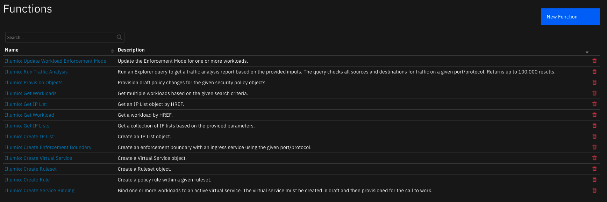
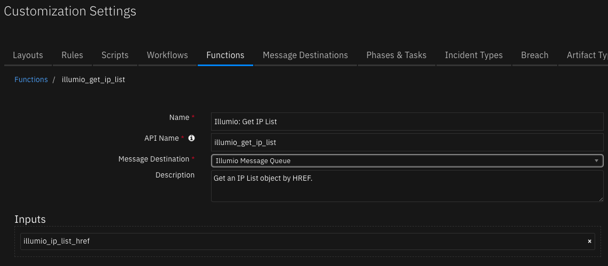
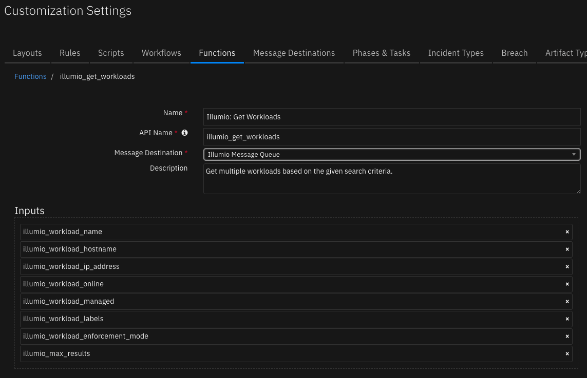
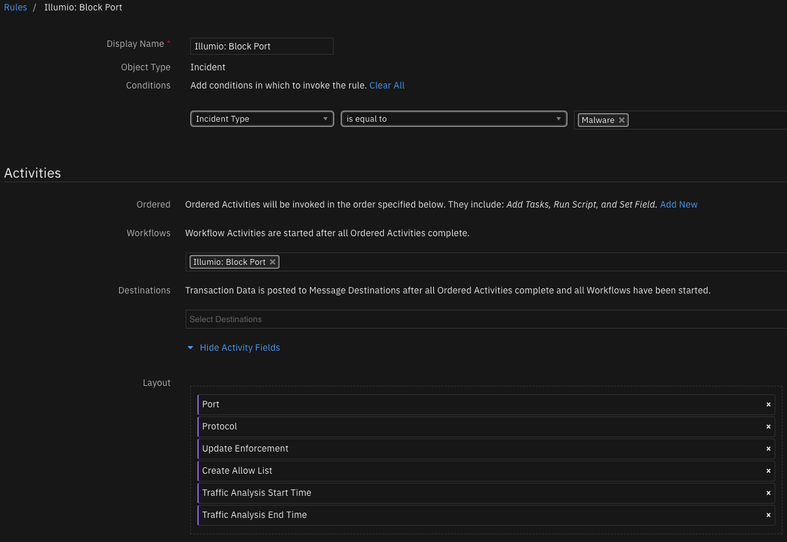

# User Guide: fn_illumio_v1.0.0  

## Table of Contents  
- [Overview](#overview)
- [Key Features](#key-features)
- [Function - Illumio: Create Enforcement Boundary](#function---illumio-create-enforcement-boundary)
- [Function - Illumio: Create Virtual Service](#function---illumio-create-virtual-service)
- [Function - Illumio: Create Service Binding](#function---illumio-create-service-binding)
- [Function - Illumio: Create Ruleset](#function---illumio-create-ruleset)
- [Function - Illumio: Create Rule](#function---illumio-create-rule)
- [Function - Illumio: Create IP List](#function---illumio-create-ip-list)
- [Function - Illumio: Get IP List](#function---illumio-get-ip-list)
- [Function - Illumio: Get IP Lists](#function---illumio-get-ip-lists)
- [Function - Illumio: Get Workload](#function---illumio-get-workload)
- [Function - Illumio: Get Workloads](#function---illumio-get-workloads)
- [Function - Illumio: Run Traffic Analysis](#function---illumio-run-traffic-analysis)
- [Function - Illumio: Provision Objects](#function---illumio-provision-objects)
- [Function - Illumio: Update Workload Enforcement Mode](#function---illumio-update-workload-enforcement-mode)
- [Rule - Illumio: Block Port](#rule---illumio-block-port)
- [Rule - Illumio: Block Selected Port](#rule---illumio-block-selected-port)
- [Workflow - Illumio: Block Port](#workflow---illumio-block-port)
- [Workflow - Illumio: Block Selected Port](#workflow---illumio-block-selected-port)
- [Data Table - Traffic Flows](#data-table---traffic-flows)

---

## Overview  

The [Illumio Core security platform](https://www.illumio.com/products/core) provides a micro-segmentation solution that enhances network security and prevents propagation of attacks. The Illumio integration with the IBM SOAR platform allows you to automate actions in the Illumio Core Policy Compute Engine using SOAR functions and workflows.  

You can find additional documentation for your version of Illumio Core through the [Illumio Support Portal](https://docs.illumio.com/core/21.2/Content/Home.htm).  

### Key Features  
The following functions are currently implemented:  

* Create an Enforcement Boundary
* Create an IP List
* Create a Rule Set
    * Create a Rule
* Create a Virtual Service
    * Bind Workloads to a Virtual Service
* Get a collection of IP Lists
* Get an IP List by HREF
* Get a collection of Workloads
* Get a Workload by HREF
* Provision policy objects
* Run a traffic analysis query
* Update the enforcement modes of one or more Workloads

Additionally, the integration provides the following workflow actions:  

* Block traffic on a specified port and protocol across all Workloads



These functions are covered in more detail below.  

---

## Function - Illumio: Create Enforcement Boundary  
Create an enforcement boundary with an ingress service using the given port/protocol.  

 

<details><summary>Inputs:</summary>
<p>

| Name | Type | Required | Example | Tooltip |
| ---- | :--: | :------: | ------- | ------- |
| `illumio_enforcement_boundary_consumers` | `text` | Yes | `ams` | Comma-separated list of HREFs of entities to be used as consumers for the rule, or "ams" for all workloads |
| `illumio_enforcement_boundary_name` | `text` | Yes | `EB-IBM-SOAR` | Enforcement boundary name |
| `illumio_enforcement_boundary_providers` | `text` | Yes | `ams` | Comma-separated list of HREFs of entities to be used as providers for the rule, or "ams" for all workloads |
| `illumio_port` | `number` | Yes | `8080` | Port number |
| `illumio_protocol` | `select` | Yes | `-` | Communication protocol |

</p>
</details>

<details><summary>Outputs:</summary>
<p>

```python
results = {
    "version": 2.0,
    "success": True,
    "reason": None,
    "content": {
        "href": "/orgs/1/sec_policy/active/enforcement_boundaries/1019",
        "name": "EB-IBM-SOAR-3389-TCP",
        "created_at": "2022-01-07T16:17:25.515Z",
        "updated_at": "2022-01-07T16:17:25.526Z",
        "created_by": {
            "href": "/users/464"
        },
        "updated_by": {
            "href": "/users/464"
        },
        "caps": [
            "write",
            "provision"
        ],
        "ingress_services": [
            {
                "port": 3389,
                "proto": 6
            }
        ],
        "providers": [
            {
                "actors": "ams"
            }
        ],
        "consumers": [
            {
                "ip_list": {
                    "href": "/orgs/1/sec_policy/active/ip_lists/1334"
                }
            }
        ]
    },
    "raw": None,
    "inputs": {
        "illumio_protocol": "TCP",
        "illumio_enforcement_boundary_providers": "ams",
        "illumio_enforcement_boundary_name": "EB-IBM-SOAR-3389-TCP",
        "illumio_port": 3389,
        "illumio_enforcement_boundary_consumers": "/orgs/1/sec_policy/active/ip_lists/1334"
    },
    "metrics": {
        "version": "1.0",
        "package": "fn-illumio",
        "package_version": "1.0.0",
        "host": "C02G82JEMD6R",
        "execution_time_ms": 604,
        "timestamp": "2022-01-07 11:41:47"
    }
}
```

</p>
</details>

<details><summary>Example Pre-Process Script:</summary>
<p>

```python
inputs.illumio_port = rule.properties.illumio_port
inputs.illumio_protocol = rule.properties.illumio_protocol
inputs.illumio_enforcement_boundary_name = "EB-IBM-SOAR-{0}-{1}".format(str(rule.properties.illumio_port), rule.properties.illumio_protocol)
inputs.illumio_enforcement_boundary_consumers = workflow.properties.any_ip_list.content['href']
```

</p>
</details>

<details><summary>Example Post-Process Script:</summary>
<p>

```python
None
```

</p>
</details>

---

## Function - Illumio: Create Virtual Service  
Create a Virtual Service.  

 

<details><summary>Inputs:</summary>
<p>

| Name | Type | Required | Example | Tooltip |
| ---- | :--: | :------: | ------- | ------- |
| `illumio_port` | `number` | Yes | `8080` | Port number |
| `illumio_protocol` | `select` | Yes | `-` | Communication protocol. TCP and UDP are supported |
| `illumio_virtual_service_name` | `text` | Yes | `VS-IBM-SOAR` | Virtual service name. If no value is set, use the value SOAR-{port}-{protocol} |

</p>
</details>

<details><summary>Outputs:</summary>
<p>

```python
results = {
    "version": 2.0,
    "success": True,
    "reason": None,
    "content": {
        "href": "/orgs/1/sec_policy/draft/virtual_services/575f43f4-3f99-4bb0-8a6f-9e2da7a9fbd2",
        "name": "VS-IBM-SOAR-3389-TCP",
        "created_at": "2022-01-07T15:23:17.885Z",
        "updated_at": "2022-01-07T15:23:17.897Z",
        "update_type": "create",
        "created_by": {
            "href": "/users/464"
        },
        "updated_by": {
            "href": "/users/464"
        },
        "caps": [
            "write",
            "provision",
            "delete"
        ],
        "apply_to": "host_only",
        "service_ports": [
            {
                "port": 3389,
                "proto": 6
            }
        ],
        "ip_overrides": []
    },
    "raw": None,
    "inputs": {
        "illumio_protocol": "TCP",
        "illumio_port": 3389,
        "illumio_virtual_service_name": "VS-IBM-SOAR-3389-TCP"
    },
    "metrics": {
        "version": "1.0",
        "package": "fn-illumio",
        "package_version": "1.0.0",
        "host": "C02G82JEMD6R",
        "execution_time_ms": 658,
        "timestamp": "2022-01-07 10:23:17"
    }
}
```

</p>
</details>

<details><summary>Example Pre-Process Script:</summary>
<p>

```python
inputs.illumio_port = rule.properties.illumio_port
inputs.illumio_protocol = rule.properties.illumio_protocol
inputs.illumio_virtual_service_name = "VS-IBM-SOAR-{0}-{1}".format(str(rule.properties.illumio_port), rule.properties.illumio_protocol)
```

</p>
</details>

<details><summary>Example Post-Process Script:</summary>
<p>

```python
None
```

</p>
</details>

---

## Function - Illumio: Create Service Binding  
Bind one or more workloads to an active virtual service. The virtual service must be created in draft and then provisioned for the call to work.  

 

<details><summary>Inputs:</summary>
<p>

| Name | Type | Required | Example | Tooltip |
| ---- | :--: | :------: | ------- | ------- |
| `illumio_virtual_service_href` | `text` | Yes | `-` | Virtual Service object reference key |
| `illumio_workload_hrefs` | `text` | Yes | `-` | Comma-separated string of workload HREF values |

</p>
</details>

<details><summary>Outputs:</summary>
<p>

```python
results = {
    "version": 2.0,
    "success": True,
    "reason": None,
    "content": {
        "service_bindings": [
            {
                "href": "/orgs/1/service_bindings/c7098f30-8460-4873-a06c-8df87dc1ba1d"
            },
            {
                "href": "/orgs/1/service_bindings/ef302a43-0e59-4288-a4aa-1196369d1f29"
            },
            {
                "href": "/orgs/1/service_bindings/0fe5b79a-0b0d-4281-89db-d8a7867aaf61"
            }
        ],
        "errors": []
    },
    "raw": None,
    "inputs": {
        "illumio_workload_hrefs": "/orgs/1/workloads/32e366cc-bd18-44aa-a637-9a6e761e268e,/orgs/1/workloads/c733e8b0-fbc8-4764-b313-1655072c65df,/orgs/1/workloads/9c8b69b9-c741-4689-b8c7-f8ebee0dbee8",
        "illumio_virtual_service_href": "/orgs/1/sec_policy/active/virtual_services/575f43f4-3f99-4bb0-8a6f-9e2da7a9fbd2"
    },
    "metrics": {
        "version": "1.0",
        "package": "fn-illumio",
        "package_version": "1.0.0",
        "host": "C02G82JEMD6R",
        "execution_time_ms": 469,
        "timestamp": "2022-01-07 10:23:22"
    }
}
```

</p>
</details>

<details><summary>Example Pre-Process Script:</summary>
<p>

```python
inputs.illumio_virtual_service_href = workflow.properties.virtual_service_active_href['href']
inputs.illumio_workload_hrefs = ','.join(workflow.properties.traffic_flow_workloads['hrefs'])
```

</p>
</details>

<details><summary>Example Post-Process Script:</summary>
<p>

```python
None
```

</p>
</details>

---

## Function - Illumio: Create Ruleset  
Create a ruleset security policy object.  

 

<details><summary>Inputs:</summary>
<p>

| Name | Type | Required | Example | Tooltip |
| ---- | :--: | :------: | ------- | ------- |
| `illumio_ruleset_name` | `text` | Yes | `RS-IBM-SOAR` | Ruleset display name |

</p>
</details>

<details><summary>Outputs:</summary>
<p>

```python
results = {
    "version": 2.0,
    "success": True,
    "reason": None,
    "content": {
        "href": "/orgs/1/sec_policy/draft/rule_sets/11110",
        "name": "RS-IBM-SOAR-3389-TCP",
        "created_at": "2022-01-07T15:23:25.411Z",
        "updated_at": "2022-01-07T15:23:25.411Z",
        "update_type": "create",
        "created_by": {
            "href": "/users/464"
        },
        "updated_by": {
            "href": "/users/464"
        },
        "caps": [
            "write",
            "provision"
        ],
        "enabled": True,
        "scopes": [
            []
        ]
    },
    "raw": None,
    "inputs": {
        "illumio_ruleset_name": "RS-IBM-SOAR-3389-TCP"
    },
    "metrics": {
        "version": "1.0",
        "package": "fn-illumio",
        "package_version": "1.0.0",
        "host": "C02G82JEMD6R",
        "execution_time_ms": 780,
        "timestamp": "2022-01-07 10:23:25"
    }
}
```

</p>
</details>

<details><summary>Example Pre-Process Script:</summary>
<p>

```python
inputs.illumio_ruleset_name = "RS-IBM-SOAR-{0}-{1}".format(str(rule.properties.illumio_port), rule.properties.illumio_protocol)
```

</p>
</details>

<details><summary>Example Post-Process Script:</summary>
<p>

```python
None
```

</p>
</details>

---

## Function - Illumio: Create Rule  
Create a policy rule within a given ruleset.  

 

<details><summary>Inputs:</summary>
<p>

| Name | Type | Required | Example | Tooltip |
| ---- | :--: | :------: | ------- | ------- |
| `illumio_rule_consumers` | `text` | Yes | `-` | Comma-separated list of HREFs of entities to be used as consumers |
| `illumio_rule_providers` | `text` | Yes | `-` | Comma-separated list of HREFs of entities to be used as providers |
| `illumio_rule_resolve_consumers_as` | `multiselect` | Yes | `-` | Consumer objects the rule should apply to |
| `illumio_rule_resolve_providers_as` | `multiselect` | Yes | `-` | Provider objects the rule should apply to |
| `illumio_ruleset_href` | `text` | Yes | `-` | Ruleset object reference key |

</p>
</details>

<details><summary>Outputs:</summary>
<p>

```python
results = {
    "version": 2.0,
    "success": True,
    "reason": None,
    "content": {
        "href": "/orgs/1/sec_policy/draft/rule_sets/11110/sec_rules/18665",
        "created_at": "2022-01-07T16:41:42.244Z",
        "updated_at": "2022-01-07T16:41:42.255Z",
        "update_type": "create",
        "created_by": {
            "href": "/users/464"
        },
        "updated_by": {
            "href": "/users/464"
        },
        "ingress_services": [],
        "providers": [
            {
                "virtual_service": {
                    "href": "/orgs/1/sec_policy/draft/virtual_services/575f43f4-3f99-4bb0-8a6f-9e2da7a9fbd2"
                }
            }
        ],
        "consumers": [
            {
                "ip_list": {
                    "href": "/orgs/1/sec_policy/draft/ip_lists/1334"
                }
            }
        ],
        "enabled": True,
        "resolve_labels_as": {
            "providers": [
                "virtual_services"
            ],
            "consumers": [
                "workloads"
            ]
        },
        "sec_connect": False,
        "stateless": False,
        "machine_auth": False,
        "unscoped_consumers": False,
        "network_type": "brn"
    },
    "raw": None,
    "inputs": {
        "illumio_rule_resolve_consumers_as": [
            "workloads"
        ],
        "illumio_rule_consumers": "/orgs/1/sec_policy/active/ip_lists/1334",
        "illumio_ruleset_href": "/orgs/1/sec_policy/draft/rule_sets/11110",
        "illumio_rule_resolve_providers_as": [
            "virtual_services"
        ],
        "illumio_rule_providers": "/orgs/1/sec_policy/active/virtual_services/575f43f4-3f99-4bb0-8a6f-9e2da7a9fbd2"
    },
    "metrics": {
        "version": "1.0",
        "package": "fn-illumio",
        "package_version": "1.0.0",
        "host": "C02G82JEMD6R",
        "execution_time_ms": 457,
        "timestamp": "2022-01-07 11:41:42"
    }
}
```

</p>
</details>

<details><summary>Example Pre-Process Script:</summary>
<p>

```python
inputs.illumio_ruleset_href = workflow.properties.ruleset.content['href']
inputs.illumio_rule_consumers = workflow.properties.any_ip_list.content['href']
inputs.illumio_rule_providers = workflow.properties.virtual_service_active_href['href']
```

</p>
</details>

<details><summary>Example Post-Process Script:</summary>
<p>

```python
None
```

</p>
</details>

---

## Function - Illumio: Create IP List  
Create an IP List object.  

 

<details><summary>Inputs:</summary>
<p>

| Name | Type | Required | Example | Tooltip |
| ---- | :--: | :------: | ------- | ------- |
| `illumio_ip_list_name` | `text` | No | `IPL-IBM-SOAR` | IP List name. Defaults to IPL-IBM-SOAR |
| `illumio_ip_list_description` | `text` | No | `IP list created through IBM SOAR.` | IP List description. |
| `illumio_ip_list_fqdns` | `text` | No | `example1.com,example2.com` | Comma-separated list of FQDNs to add to the created IP list. Note that either FQDNs or IP ranges must be provided for valid IP list creation. |
| `illumio_ip_list_ip_ranges` | `text` | No | `127.0.0.1,10.0.0.0/8,172.168.0.2-172.168.0.12` | Comma-separated list of IP addresses or ranges to include in the created IP list. The values can be single IPs, CIDR format, or hyphenated start-end ranges. Note that either IP ranges or FQDNs must be provided for valid IP list creation. |

</p>
</details>

<details><summary>Outputs:</summary>
<p>

```python
results = {
    "version": 2.0,
    "success": true,
    "reason": null,
    "content": {
        "href": "/orgs/28/sec_policy/draft/ip_lists/2335",
        "name": "IPL-LAB",
        "description": "",
        "created_at": "2022-03-10T04:33:50.982Z",
        "updated_at": "2022-03-10T04:33:50.989Z",
        "update_type": "create",
        "created_by": {
            "href": "/users/520"
        },
        "updated_by": {
            "href": "/users/520"
        },
        "ip_ranges": [
            {
                "from_ip": "10.2.24.0/28",
                "exclusion": false
            },
            {
                "from_ip": "10.8.16.192",
                "to_ip": "10.8.16.212",
                "exclusion": false
            },
            {
                "from_ip": "10.10.0.146",
                "exclusion": false
            }
        ],
        "fqdns": [
            {
                "fqdn": "ibmsoar.lab.com"
            },
            {
                "fqdn": "apphost.lab.com"
            }
        ]
    },
    "raw": null,
    "inputs": {
        "illumio_ip_list_ip_ranges": "10.2.24.0/28,10.8.16.192-10.8.16.212,10.10.0.146",
        "illumio_ip_list_name": "IPL-LAB",
        "illumio_ip_list_description": "",
        "illumio_ip_list_fqdns": "ibmsoar.lab.com,apphost.lab.com"
    },
    "metrics": {
        "version": "1.0",
        "package": "fn-illumio",
        "package_version": "1.1.0",
        "host": "C02G82JEMD6R",
        "execution_time_ms": 812,
        "timestamp": "2022-03-09 23:33:50"
    }
}
```

</p>
</details>

<details><summary>Example Pre-Process Script:</summary>
<p>

```python
None
```

</p>
</details>

<details><summary>Example Post-Process Script:</summary>
<p>

```python
None
```

</p>
</details>

---

## Function - Illumio: Get IP List  
Get an IP List object by HREF.  

 

<details><summary>Inputs:</summary>
<p>

| Name | Type | Required | Example | Tooltip |
| ---- | :--: | :------: | ------- | ------- |
| `illumio_ip_list_href` | `text` | Yes | `/orgs/1/sec_policy/active/ip_lists/1` | IP List object reference key. |

</p>
</details>

<details><summary>Outputs:</summary>
<p>

```python
results = {
    "version": 2.0,
    "success": True,
    "reason": None,
    "content": {
        "href": "/orgs/1/sec_policy/active/ip_lists/1",
        "name": "Any (0.0.0.0/0 and ::/0)",
        "created_at": "2021-09-13T15:03:07.000Z",
        "updated_at": "2021-09-13T15:03:07.015Z",
        "created_by": {"href": "/users/0"},
        "updated_by": {"href": "/users/0"},
        "ip_ranges": [
            {"from_ip": "0.0.0.0/0", "exclusion": False},
            {"from_ip": "::/0", "exclusion": False}
        ]
    },
    "raw": None,
    "inputs": {
        "illumio_ip_list_name": "Any (0.0.0.0/0 and ::/0)"
    },
    "metrics": {
        "version": "1.0",
        "package": "fn-illumio",
        "package_version": "1.0.0",
        "host": "C02G82JEMD6R",
        "execution_time_ms": 811,
        "timestamp": "2022-01-07 10:22:52"
    }
}
```

</p>
</details>

<details><summary>Example Pre-Process Script:</summary>
<p>

```python
None
```

</p>
</details>

<details><summary>Example Post-Process Script:</summary>
<p>

```python
None
```

</p>
</details>

---

## Function - Illumio: Get IP Lists  
Get a collection of IP lists based on the provided parameters.  

 

<details><summary>Inputs:</summary>
<p>

| Name | Type | Required | Example | Tooltip |
| ---- | :--: | :------: | ------- | ------- |
| `illumio_ip_list_name` | `text` | No | `Any (0.0.0.0/0 and ::/0)` | IP List object name. Supports partial matches. |
| `illumio_ip_list_fqdn` | `text` | No | `www.example.com` | IP list FQDN. Supports partial matches. |
| `illumio_ip_list_ip_address` | `text` | No | `127.0.0.1` | Search for IP lists matching the given address. Supports partial matches. |
| `illumio_max_results` | `number` | No | `500` | Limit the maximum number of results returned by the query. |

</p>
</details>

<details><summary>Outputs:</summary>
<p>

```python
results = {
    "version": 2.0,
    "success": True,
    "reason": None,
    "content": {
        "ip_lists": [
            {
                "href": "/orgs/1/sec_policy/active/ip_lists/1",
                "name": "Any (0.0.0.0/0 and ::/0)",
                "created_at": "2021-09-13T15:03:07.000Z",
                "updated_at": "2021-09-13T15:03:07.015Z",
                "created_by": {"href": "/users/0"},
                "updated_by": {"href": "/users/0"},
                "ip_ranges": [
                    {"from_ip": "0.0.0.0/0", "exclusion": False},
                    {"from_ip": "::/0", "exclusion": False}
                ]
            }
        ]
    },
    "raw": None,
    "inputs": {
        "illumio_ip_list_name": "Any (0.0.0.0/0 and ::/0)"
    },
    "metrics": {
        "version": "1.0",
        "package": "fn-illumio",
        "package_version": "1.0.0",
        "host": "C02G82JEMD6R",
        "execution_time_ms": 811,
        "timestamp": "2022-01-07 10:22:52"
    }
}
```

</p>
</details>

<details><summary>Example Pre-Process Script:</summary>
<p>

```python
None
```

</p>
</details>

<details><summary>Example Post-Process Script:</summary>
<p>

```python
None
```

</p>
</details>

---

## Function - Illumio: Get Workload  
Get a workload by HREF.  

 

<details><summary>Inputs:</summary>
<p>

| Name | Type | Required | Example | Tooltip |
| ---- | :--: | :------: | ------- | ------- |
| `illumio_workload_href` | `text` | Yes | `-` | Workload object reference key |

</p>
</details>

<details><summary>Outputs:</summary>
<p>

```python
results = {
    "version": 2.0,
    "success": True,
    "reason": None,
    "content": {
        "href": "/orgs/1/workloads/3d14ec61-edaf-452e-b1b9-b7308652c0f6",
        "created_at": "2021-09-13T16:01:07.735779Z",
        "updated_at": "2021-12-16T16:47:04.458647Z",
        "created_by": {
            "href": "/orgs/1/agents/17456"
        },
        "updated_by": {
            "href": "/orgs/1/agents/17456"
        },
        "caps": [
            "write"
        ],
        "hostname": "user-4",
        "public_ip": "66.124.202.19",
        "interfaces": [
            {
                "name": "eth0",
                "address": "fe80::402:ffff:feef:5a4d",
                "cidr_block": 64,
                "network": {
                    "href": "/orgs/1/networks/9977853d-639e-4afd-a505-9e0fd419ce06"
                },
                "network_detection_mode": "link_local",
                "loopback": False
            },
            {
                "name": "eth0",
                "address": "10.1.0.46",
                "cidr_block": 24,
                "default_gateway_address": "10.1.0.1",
                "network": {
                    "href": "/orgs/1/networks/a9dd8b22-3108-4c64-911b-ac1b2eb5919e"
                },
                "network_detection_mode": "single_private_brn",
                "loopback": False
            },
            {
                "name": "eth0.public",
                "address": "66.124.202.19",
                "cidr_block": 32,
                "network": {
                    "href": "/orgs/1/networks/a9dd8b22-3108-4c64-911b-ac1b2eb5919e"
                },
                "network_detection_mode": "manual",
                "loopback": False
            }
        ],
        "service_provider": "example.com",
        "data_center": "us-west.example.com",
        "data_center_zone": "us-west",
        "os_id": "ubuntu-x86_64-xenial",
        "os_detail": "5.4.0-1038-aws #40-Ubuntu SMP Fri Feb 5 23:50:40 UTC 2021 (Ubuntu 20.04.2 LTS)",
        "online": True,
        "deleted": False,
        "ignored_interface_names": [],
        "containers_inherit_host_policy": False,
        "blocked_connection_action": "drop",
        "labels": [
            {
                "href": "/orgs/1/labels/15420"
            },
            {
                "href": "/orgs/1/labels/15431"
            },
            {
                "href": "/orgs/1/labels/15430"
            },
            {
                "href": "/orgs/1/labels/15411"
            }
        ],
        "agent": {
            "href": "/orgs/1/agents/17456",
            "config": {
                "mode": "illuminated",
                "log_traffic": False,
                "visibility_level": "flow_summary"
            },
            "status": {
                "status": "active",
                "uid": "us-west+i-0ab12cd3e4fg5678h",
                "instance_id": "i-0ab12cd3e4fg5678h",
                "last_heartbeat_on": "2022-01-07T16:14:31.378648Z",
                "uptime_seconds": 10025687,
                "agent_version": "21.2.0-7831",
                "managed_since": "2021-09-13T16:01:07.772006Z",
                "fw_config_current": False,
                "firewall_rule_count": 0,
                "security_policy_refresh_at": "2022-01-03T20:54:34.809195Z",
                "security_policy_applied_at": "2022-01-03T20:54:34.809195Z",
                "security_policy_received_at": "2022-01-03T20:54:34.809195Z",
                "agent_health_errors": {
                    "errors": [],
                    "warnings": []
                },
                "security_policy_sync_state": "syncing"
            },
            "unpair_allowed": True,
            "type": "Host"
        },
        "ven": {
            "href": "/orgs/1/vens/3d14ec61-edaf-452e-b1b9-b7308652c0f6"
        },
        "enforcement_mode": "visibility_only",
        "visibility_level": "flow_summary"
    },
    "raw": None,
    "inputs": {
        "illumio_workload_href": "/orgs/1/workloads/3d14ec61-edaf-452e-b1b9-b7308652c0f6"
    },
    "metrics": {
        "version": "1.0",
        "package": "fn-illumio",
        "package_version": "1.0.0",
        "host": "C02G82JEMD6R",
        "execution_time_ms": 486,
        "timestamp": "2022-01-07 10:27:31"
    }
}
```

</p>
</details>

<details><summary>Example Pre-Process Script:</summary>
<p>

```python
None
```

</p>
</details>

<details><summary>Example Post-Process Script:</summary>
<p>

```python
None
```

</p>
</details>

---

## Function - Illumio: Get Workloads  
Get multiple workloads based on the given search criteria.  

 

<details><summary>Inputs:</summary>
<p>

| Name | Type | Required | Example | Tooltip |
| ---- | :--: | :------: | ------- | ------- |
| `illumio_workload_enforcement_mode` | `select` | No | `-` | Search for workloads based on enforcement mode. |
| `illumio_workload_hostname` | `text` | No | `-` | The hostname of the workload to search for. |
| `illumio_workload_ip_address` | `text` | No | `127.0.0.1` | The IP address of the workload to search for. Supports partial matches. |
| `illumio_workload_labels` | `text` | No | `-` | Search for workloads based on a comma-separated list of Label HREFs. |
| `illumio_workload_managed` | `boolean` | No | `-` | If set, returns only managed workloads if true, or unmanaged workloads if false. |
| `illumio_workload_name` | `text` | No | `-` | The name of the workload(s) to search for. Supports partial matches. |
| `illumio_workload_online` | `boolean` | No | `-` | If set, returns only online workloads if true or offline workloads if false. |
| `illumio_max_results` | `number` | No | `500` | Limit the maximum number of results returned by the query. |

</p>
</details>

<details><summary>Outputs:</summary>
<p>

```python
results = {
    "version": 2.0,
    "success": True,
    "reason": None,
    "content": {
        "workloads": [
            {
                "href": "/orgs/1/workloads/3d14ec61-edaf-452e-b1b9-b7308652c0f6",
                "created_at": "2021-09-13T16:01:07.735779Z",
                "updated_at": "2021-12-16T16:47:04.458647Z",
                "created_by": {
                    "href": "/orgs/1/agents/17456"
                },
                "updated_by": {
                    "href": "/orgs/1/agents/17456"
                },
                "caps": [
                    "write"
                ],
                "hostname": "user-4",
                "public_ip": "66.124.202.19",
                "interfaces": [
                    {
                        "name": "eth0",
                        "address": "fe80::402:ffff:feef:5a4d",
                        "cidr_block": 64,
                        "network": {
                            "href": "/orgs/1/networks/9977853d-639e-4afd-a505-9e0fd419ce06"
                        },
                        "network_detection_mode": "link_local",
                        "loopback": False
                    },
                    {
                        "name": "eth0",
                        "address": "10.1.0.46",
                        "cidr_block": 24,
                        "default_gateway_address": "10.1.0.1",
                        "network": {
                            "href": "/orgs/1/networks/a9dd8b22-3108-4c64-911b-ac1b2eb5919e"
                        },
                        "network_detection_mode": "single_private_brn",
                        "loopback": False
                    },
                    {
                        "name": "eth0.public",
                        "address": "66.124.202.19",
                        "cidr_block": 32,
                        "network": {
                            "href": "/orgs/1/networks/a9dd8b22-3108-4c64-911b-ac1b2eb5919e"
                        },
                        "network_detection_mode": "manual",
                        "loopback": False
                    }
                ],
                "service_provider": "example.com",
                "data_center": "us-west.example.com",
                "data_center_zone": "us-west",
                "os_id": "ubuntu-x86_64-xenial",
                "os_detail": "5.4.0-1038-aws #40-Ubuntu SMP Fri Feb 5 23:50:40 UTC 2021 (Ubuntu 20.04.2 LTS)",
                "online": True,
                "deleted": False,
                "ignored_interface_names": [],
                "containers_inherit_host_policy": False,
                "blocked_connection_action": "drop",
                "labels": [
                    {
                        "href": "/orgs/1/labels/15420"
                    },
                    {
                        "href": "/orgs/1/labels/15431"
                    },
                    {
                        "href": "/orgs/1/labels/15430"
                    },
                    {
                        "href": "/orgs/1/labels/15411"
                    }
                ],
                "agent": {
                    "href": "/orgs/1/agents/17456",
                    "config": {
                        "mode": "illuminated",
                        "log_traffic": False,
                        "visibility_level": "flow_summary"
                    },
                    "status": {
                        "status": "active",
                        "uid": "us-west+i-0ab12cd3e4fg5678h",
                        "instance_id": "i-0ab12cd3e4fg5678h",
                        "last_heartbeat_on": "2022-01-07T16:14:31.378648Z",
                        "uptime_seconds": 10025687,
                        "agent_version": "21.2.0-7831",
                        "managed_since": "2021-09-13T16:01:07.772006Z",
                        "fw_config_current": False,
                        "firewall_rule_count": 0,
                        "security_policy_refresh_at": "2022-01-03T20:54:34.809195Z",
                        "security_policy_applied_at": "2022-01-03T20:54:34.809195Z",
                        "security_policy_received_at": "2022-01-03T20:54:34.809195Z",
                        "agent_health_errors": {
                            "errors": [],
                            "warnings": []
                        },
                        "security_policy_sync_state": "syncing"
                    },
                    "unpair_allowed": True,
                    "type": "Host"
                },
                "ven": {
                    "href": "/orgs/1/vens/3d14ec61-edaf-452e-b1b9-b7308652c0f6"
                },
                "enforcement_mode": "visibility_only",
                "visibility_level": "flow_summary"
            },
            {
                "href": "/orgs/1/workloads/1fd97272-1497-47b8-95c9-6f530dbe0749",
                "created_at": "2021-09-13T16:00:39.951135Z",
                "updated_at": "2021-12-16T16:47:04.465816Z",
                "created_by": {
                    "href": "/orgs/1/agents/17423"
                },
                "updated_by": {
                    "href": "/orgs/1/agents/17423"
                },
                "caps": [
                    "write"
                ],
                "hostname": "dev-db-2",
                "public_ip": "66.124.202.19",
                "interfaces": [
                    {
                        "name": "eth0",
                        "address": "fe80::45a:d8ff:fea9:54b1",
                        "cidr_block": 64,
                        "network": {
                            "href": "/orgs/1/networks/9977853d-639e-4afd-a505-9e0fd419ce06"
                        },
                        "network_detection_mode": "link_local",
                        "loopback": False
                    },
                    {
                        "name": "eth0",
                        "address": "10.1.0.82",
                        "cidr_block": 24,
                        "default_gateway_address": "10.1.0.1",
                        "network": {
                            "href": "/orgs/1/networks/a9dd8b22-3108-4c64-911b-ac1b2eb5919e"
                        },
                        "network_detection_mode": "single_private_brn",
                        "loopback": False
                    },
                    {
                        "name": "eth0.public",
                        "address": "66.124.202.19",
                        "cidr_block": 32,
                        "network": {
                            "href": "/orgs/1/networks/a9dd8b22-3108-4c64-911b-ac1b2eb5919e"
                        },
                        "network_detection_mode": "manual",
                        "loopback": False
                    }
                ],
                "service_provider": "example.com",
                "data_center": "us-west.example.com",
                "data_center_zone": "us-west",
                "os_id": "ubuntu-x86_64-xenial",
                "os_detail": "5.4.0-1038-aws #40-Ubuntu SMP Fri Feb 5 23:50:40 UTC 2021 (Ubuntu 20.04.2 LTS)",
                "online": True,
                "deleted": False,
                "ignored_interface_names": [],
                "containers_inherit_host_policy": False,
                "blocked_connection_action": "drop",
                "labels": [
                    {
                        "href": "/orgs/1/labels/15427"
                    },
                    {
                        "href": "/orgs/1/labels/15426"
                    },
                    {
                        "href": "/orgs/1/labels/15418"
                    },
                    {
                        "href": "/orgs/1/labels/15422"
                    }
                ],
                "agent": {
                    "href": "/orgs/1/agents/17423",
                    "config": {
                        "mode": "illuminated",
                        "log_traffic": False,
                        "visibility_level": "flow_summary"
                    },
                    "status": {
                        "status": "active",
                        "uid": "us-west+i-0e65e2aec3677d51e",
                        "instance_id": "i-0e65e2aec3677d51e",
                        "last_heartbeat_on": "2022-01-07T16:15:17.913215Z",
                        "uptime_seconds": 10025636,
                        "agent_version": "21.2.0-7831",
                        "managed_since": "2021-09-13T16:00:39.974839Z",
                        "fw_config_current": False,
                        "firewall_rule_count": 0,
                        "security_policy_refresh_at": "2022-01-03T20:55:54.361991Z",
                        "security_policy_applied_at": "2022-01-03T20:55:54.361991Z",
                        "security_policy_received_at": "2022-01-03T20:55:54.361991Z",
                        "agent_health_errors": {
                            "errors": [],
                            "warnings": []
                        },
                        "security_policy_sync_state": "syncing"
                    },
                    "unpair_allowed": True,
                    "type": "Host"
                },
                "ven": {
                    "href": "/orgs/1/vens/1fd97272-1497-47b8-95c9-6f530dbe0749"
                },
                "enforcement_mode": "visibility_only",
                "visibility_level": "flow_summary"
            }
        ]
    },
    "raw": None,
    "inputs": {
        "illumio_workload_enforcement_mode": "visibility_only",
        "illumio_workload_managed": True
    },
    "metrics": {
        "version": "1.0",
        "package": "fn-illumio",
        "package_version": "1.0.0",
        "host": "C02G82JEMD6R",
        "execution_time_ms": 534,
        "timestamp": "2022-01-07 11:41:53"
    }
}
```

</p>
</details>

<details><summary>Example Pre-Process Script:</summary>
<p>

```python
None
```

</p>
</details>

<details><summary>Example Post-Process Script:</summary>
<p>

```python
workload_hrefs = [workload['href'] for workload in results.content['workloads']]
workflow.addProperty('workload_hrefs', {'hrefs': workload_hrefs})

```

</p>
</details>

---

## Function - Illumio: Run Traffic Analysis  
Run an Explorer query to get a traffic analysis report based on the provided inputs. The query checks all sources and destinations for traffic on a given port/protocol. Returns up to 100,000 results.  

 

<details><summary>Inputs:</summary>
<p>

| Name | Type | Required | Example | Tooltip |
| ---- | :--: | :------: | ------- | ------- |
| `illumio_port` | `number` | Yes | `8080` | Port number |
| `illumio_protocol` | `select` | Yes | `-` | Communication protocol |
| `illumio_traffic_analysis_end_time` | `datetimepicker` | Yes | `-` | End of the query time range |
| `illumio_traffic_analysis_policy_decisions` | `multiselect` | Yes | `-` | List of policy decisions to include in the search results |
| `illumio_traffic_analysis_start_time` | `datetimepicker` | Yes | `-` | Start of the query time range |

</p>
</details>

<details><summary>Outputs:</summary>
<p>

```python
results = {
    "version": 2.0,
    "success": True,
    "reason": None,
    "content": {
        "traffic_flows": [
            {
                "src": {
                    "ip": "198.204.226.234"
                },
                "dst": {
                    "ip": "10.1.100.43",
                    "workload": {
                        "href": "/orgs/1/workloads/9c8b69b9-c741-4689-b8c7-f8ebee0dbee8",
                        "hostname": "windows-jumpbox-1",
                        "os_type": "windows",
                        "labels": [
                            {
                                "href": "/orgs/1/labels/15415",
                                "key": "app",
                                "value": "A-ADMIN"
                            },
                            {
                                "href": "/orgs/1/labels/15411",
                                "key": "env",
                                "value": "E-PROD"
                            },
                            {
                                "href": "/orgs/1/labels/15412",
                                "key": "loc",
                                "value": "L-DALLAS"
                            },
                            {
                                "href": "/orgs/1/labels/15416",
                                "key": "role",
                                "value": "R-JUMP-SRV"
                            }
                        ]
                    }
                },
                "service": {
                    "port": 3389,
                    "proto": 6,
                    "process_name": "svchost.exe",
                    "windows_service_name": "TermService",
                    "user_name": "NETWORK SERVICE"
                },
                "num_connections": 1,
                "state": "active",
                "timestamp_range": {
                    "first_detected": "2021-12-29T20:38:13Z",
                    "last_detected": "2021-12-29T20:38:13Z"
                },
                "dst_bi": 0,
                "dst_bo": 0,
                "policy_decision": "potentially_blocked",
                "flow_direction": "inbound"
            },
            {
                "src": {
                    "ip": "27.124.5.118"
                },
                "dst": {
                    "ip": "10.1.100.43",
                    "workload": {
                        "href": "/orgs/1/workloads/9c8b69b9-c741-4689-b8c7-f8ebee0dbee8",
                        "hostname": "windows-jumpbox-1",
                        "os_type": "windows",
                        "labels": [
                            {
                                "href": "/orgs/1/labels/15415",
                                "key": "app",
                                "value": "A-ADMIN"
                            },
                            {
                                "href": "/orgs/1/labels/15411",
                                "key": "env",
                                "value": "E-PROD"
                            },
                            {
                                "href": "/orgs/1/labels/15412",
                                "key": "loc",
                                "value": "L-DALLAS"
                            },
                            {
                                "href": "/orgs/1/labels/15416",
                                "key": "role",
                                "value": "R-JUMP-SRV"
                            }
                        ]
                    }
                },
                "service": {
                    "port": 3389,
                    "proto": 6,
                    "process_name": "svchost.exe",
                    "windows_service_name": "TermService",
                    "user_name": "NETWORK SERVICE"
                },
                "num_connections": 17,
                "state": "timed out",
                "timestamp_range": {
                    "first_detected": "2021-12-25T13:49:29Z",
                    "last_detected": "2021-12-25T13:49:29Z"
                },
                "dst_bi": 0,
                "dst_bo": 0,
                "policy_decision": "potentially_blocked",
                "flow_direction": "inbound"
            }
        ]
    },
    "raw": None,
    "inputs": {
        "illumio_protocol": "TCP",
        "illumio_traffic_analysis_policy_decisions": ["potentially_blocked", "unknown"],
        "illumio_traffic_analysis_end_time": 1640926800000,
        "illumio_traffic_analysis_start_time": 1640322000000,
        "illumio_port": 3389
    },
    "metrics": {
        "version": "1.0",
        "package": "fn-illumio",
        "package_version": "1.0.0",
        "host": "C02G82JEMD6R",
        "execution_time_ms": 8923,
        "timestamp": "2022-01-07 10:23:10"
    }
}
```

</p>
</details>

<details><summary>Example Pre-Process Script:</summary>
<p>

```python
from datetime import datetime, timezone, timedelta

inputs.illumio_port = rule.properties.illumio_port
inputs.illumio_protocol = rule.properties.illumio_protocol

start_time = rule.properties.illumio_block_port_traffic_analysis_start_time
end_time = rule.properties.illumio_block_port_traffic_analysis_end_time

inputs.illumio_traffic_analysis_start_time = start_time
inputs.illumio_traffic_analysis_end_time = end_time

```

</p>
</details>

<details><summary>Example Post-Process Script:</summary>
<p>

```python
flows = results.content['traffic_flows']
traffic_flow_workloads = set()

for flow in flows:
    if 'workload' in flow['dst'] and flow['dst']['workload']['href']:
        traffic_flow_workloads.add(flow['dst']['workload']['href'])

workflow.addProperty('traffic_flow_workloads', {'hrefs': list(traffic_flow_workloads)})
incident.addNote(
    helper.createRichText(
        u"<b>Illumio: Block Port</b> workflow: found <b>{0}</b> distinct traffic flows".format(len(traffic_flow_workloads))
    )
)

```

</p>
</details>

---

## Function - Illumio: Provision Objects  
Provision draft policy changes for the given security policy objects.  

 

<details><summary>Inputs:</summary>
<p>

| Name | Type | Required | Example | Tooltip |
| ---- | :--: | :------: | ------- | ------- |
| `illumio_policy_object_hrefs` | `text` | Yes | `-` | Comma-separated list of policy object HREFs |

</p>
</details>

<details><summary>Outputs:</summary>
<p>

```python
results = {
    "version": 2.0,
    "success": True,
    "reason": None,
    "content": {
        "provisioned_hrefs": [
            "/orgs/1/sec_policy/active/virtual_services/575f43f4-3f99-4bb0-8a6f-9e2da7a9fbd2"
        ]
    },
    "raw": None,
    "inputs": {
        "illumio_policy_object_hrefs": "/orgs/1/sec_policy/draft/virtual_services/575f43f4-3f99-4bb0-8a6f-9e2da7a9fbd2"
    },
    "metrics": {
        "version": "1.0",
        "package": "fn-illumio",
        "package_version": "1.0.0",
        "host": "C02G82JEMD6R",
        "execution_time_ms": 490,
        "timestamp": "2022-01-07 10:23:20"
    }
}
```

</p>
</details>

<details><summary>Example Pre-Process Script:</summary>
<p>

```python
inputs.illumio_policy_object_hrefs = workflow.properties.virtual_service.content['href']
```

</p>
</details>

<details><summary>Example Post-Process Script:</summary>
<p>

```python
if results.content['provisioned_hrefs']:
    active_href = results.content['provisioned_hrefs'][0]
else:
    active_href = workflow.properties.virtual_service.content['href']

workflow.addProperty('virtual_service_active_href', {'href': active_href})
incident.addNote(
    helper.createRichText(
        u"<b>Illumio: Block Port</b> workflow: provisioned virtual service with HREF <b>{0}</b>.".format(active_href)
    )
)

```

</p>
</details>

---

## Function - Illumio: Update Workload Enforcement Mode  
Update the Enforcement Mode for one or more workloads.  

 

<details><summary>Inputs:</summary>
<p>

| Name | Type | Required | Example | Tooltip |
| ---- | :--: | :------: | ------- | ------- |
| `illumio_enforcement_mode` | `select` | Yes | `-` | Workload enforcement mode |
| `illumio_workload_hrefs` | `text` | Yes | `-` | Comma-separated string of workload HREF values |

</p>
</details>

<details><summary>Outputs:</summary>
<p>

```python
results = {
    "version": 2.0,
    "success": True,
    "reason": None,
    "content": {
        "errors": [],
        "workloads": [
            "/orgs/1/workloads/3d14ec61-edaf-452e-b1b9-b7308652c0f6",
            "/orgs/1/workloads/1fd97272-1497-47b8-95c9-6f530dbe0749"
        ]
    },
    "raw": None,
    "inputs": {
        "illumio_enforcement_mode": "selective",
        "illumio_workload_hrefs": "/orgs/1/workloads/3d14ec61-edaf-452e-b1b9-b7308652c0f6,/orgs/1/workloads/1fd97272-1497-47b8-95c9-6f530dbe0749"
    },
    "metrics": {
        "version": "1.0",
        "package": "fn-illumio",
        "package_version": "1.0.0",
        "host": "C02G82JEMD6R",
        "execution_time_ms": 1107,
        "timestamp": "2022-01-07 11:17:34"
    }
}
```

</p>
</details>

<details><summary>Example Pre-Process Script:</summary>
<p>

```python
inputs.illumio_workload_hrefs = ','.join(workflow.properties.workload_hrefs['hrefs'])
```

</p>
</details>

<details><summary>Example Post-Process Script:</summary>
<p>

```python
incident.addNote(
    helper.createRichText(
        u"<b>Illumio: Block Port</b> workflow: moved all <b>Visibility Only</b> managed workloads into <b>Selective</b> enforcement."
    )
)

```

</p>
</details>

---

## Rule - Illumio: Block Port  

This rule is used to trigger the [Block Port workflow](#workflow---illumio-block-port) for a specified port and protocol.  

 

The action must be run manually from an incident of type **Malware**.  

 

The Block Port rule can be triggered from the Actions dropdown menu at the upper-right of the incident page:  

 

The workflow requires values for the following form fields attached to the Block Port Rule:

| Field | Description |
| -- | -- |
| Port | The port to block |
| Protocol | The traffic protocol to block |
| Update Enforcement | If yes, updates the enforcement mode of **all** workloads in Visibility Only mode to Selective enforcement |
| Create Allow List | If yes, creates policy objects and rules to allow traffic from the given traffic analysis timespan on the blocked port and protocol |
| Traffic Analysis Start Time | The beginning of the analysis period to find traffic flows that will be added to the allow list rule. If **Create Allow List** is set to No, these values are ignored |
| Traffic Analysis End Time | The end of the analysis period to find traffic flows that will be added to the allow list rule. If **Create Allow List** is set to No, these values are ignored |

 

---

## Rule - Illumio: Block Selected Port  

This rule is used to trigger the [Block Selected Port workflow](#workflow---illumio-block-selected-port) from an Artifact of type **Port**. It can be triggered from the Actions menu of **Port** artifact in the Artifacts tab once it has been added to an incident. The incident can be of any type.  

 

 

The Port field is not included in the form fields: the value is instead pulled from the Port Artifact. All remaining fields are identical to the **Block Port** Rule.  

 

---

## Workflow - Illumio: Block Port  

### API Name

`illumio_block_port`

### Overview

The **Block Port** workflow can be used to block incoming traffic to all workloads on a specified port and protocol. This deny rule is configured in the Illumio Policy Compute Engine using an [Enforcement Boundary](https://docs.illumio.com/core/21.2/Content/Guides/security-policy/policy-enforcement/enforcement-boundaries.htm).  

 

The first conditional branch of the workflow checks whether a [Traffic Analysis](https://docs.illumio.com/core/21.2/Content/Guides/visualization/explorer/about-explorer.htm) search should be performed for traffic within a given timespan. If so, a search is performed for any Potentially Blocked or Unknown traffic on the port and protocol to be blocked within that span of time. If any traffic flows are found, policy objects and rules are then created to make sure traffic is allowed and continues uninterrupted to the destination workloads found in the search.  

> **Note:** The Traffic Analysis timespan should not overlap with the breach - it is intended to find "good" traffic from before the attack to mitigate any interruption of legitimate services receiving traffic on the blocked port and protocol.  
>
> If you are uncertain when the breach began, err on the side of caution to avoid creating rules that may allow malicious traffic flows.   

A [Virtual Service](https://docs.illumio.com/core/21.2/Content/Guides/security-policy/security-policy-objects/virtual-services.htm) is created for the blocked port and protocol to be used in the Rule that will allow traffic. Once the Virtual Service is provisioned, the destination workloads found in the traffic analysis are then bound to it.  

A [Ruleset](https://docs.illumio.com/core/21.2/Content/Guides/security-policy/create-security-policy/segmentation-rulesets.htm) and [Rule](https://docs.illumio.com/core/21.2/Content/Guides/security-policy/create-security-policy/rules.htm) are then created and provisioned to allow the traffic.  

In all branches, an [Enforcement Boundary](https://docs.illumio.com/core/21.2/Content/Guides/security-policy/policy-enforcement/enforcement-boundaries.htm) is created to deny traffic on the specified port and protocol.  

The second conditional branch checks if the Enforcement Mode should be updated for workloads currently in Visibility Only enforcement. If so, **all** workloads in Visibility Only mode will be changed to Selective enforcement.  

---

## Workflow - Illumio: Block Selected Port  

### API Name

`illumio_block_selected_port`

### Overview

The **Block Selected Port** workflow clones the Block Port workflow and is used with the [Block Selected Port Rule](#rule---illumio-block-selected-port) to trigger from **Port**-type Artifacts. Both workflows have the same functionality outside of where the blocked port value originates.  

---

## Data Table - Traffic Flows  

Data table used to store traffic flow data returned from Explorer traffic analysis queries.  

 

### API Name

`illumio_traffic_flows`

### Columns

| Field Name | API Name  | Type | Placeholder | Required | Description |
| ---------- | --------- | ---- | ----------- | -------- | ----------- |
| Source IP  | `source_ip` | `text` | `127.0.0.1` | `Yes` | Source (consumer) IP address for the traffic flow. |
| Destination IP | `destination_ip` | `text` | `127.0.0.1` | `Yes` | Destination (provider) IP address for the traffic flow. |
| Port | `port` | `number` | `8080` | `Yes` | Traffic flow destination port. |
| Protocol | `protocol` | `select` | `TCP` | `Yes` | Traffic flow protocol. |
| Flows | `flows` | `number` | `0` | `Yes` | Flow count during detection period. |
| First Detected | `first_detected` | `text` | `2022-01-01T12:00:00Z` | `Yes` | Timestamp at which the flow was initially detected. |
| Last Detected | `last_detected` | `text` | `2022-01-01T12:00:00Z` | `Yes` | Timestamp at which the flow was last detected. |
| Flow Details | `flow_details` | `rich text` | | `No` | Any additional details about the traffic flow. |
